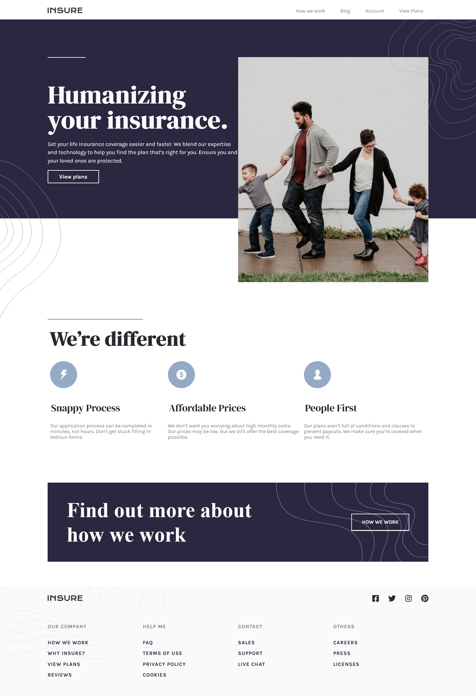

# Frontend Mentor - Insure landing page solution

This is a solution to the [Insure landing page challenge on Frontend Mentor](https://www.frontendmentor.io/challenges/insure-landing-page-uTU68JV8). Frontend Mentor challenges help you improve your coding skills by building realistic projects. 

## Table of contents

- [Overview](#overview)
  - [The challenge](#the-challenge)
  - [Screenshot](#screenshot)
- [My process](#my-process)
  - [Built with](#built-with)
  - [What I learned](#what-i-learned)
  - [Continued development](#continued-development)
  - [Useful resources](#useful-resources)
- [Author](#author)

## Overview

### The challenge

Users should be able to:

- View the optimal layout for the site depending on their device's screen size
- See hover states for all interactive elements on the page

### Screenshot




## My process
- I started of by building a desktop first markup. Usually i prefer Mobile first but this time i went with desktop first approach. Initially i made the complete structure of website using Semantic HTML5 markup like <main> and <section> tags.

- Then i styles it using SCSS as a preprocessor for CSS file. With the help of CSS Flexbox i was able to achieve the layout.
### Built with

- Semantic HTML5 markup
- CSS custom properties
- Flexbox
- CSS Grid
- Mobile-first workflow
- SCSS For CSS Preprocessors.

### What I learned


```html
<h1>Some HTML code I'm proud of</h1>
```
```css
.proud-of-this-css {
  color: papayawhip;
}
```
```js
const proudOfThisFunc = () => {
  console.log('🎉')
}
```

### Continued development

- Focusing on Advanced fluid layouts with grid and flexbox.
- More focus on JavaScript DOM.

### Useful resources

- [HTML And CSS](https://www.freecodecamp.org) - This helped me for Building core foundations in HTML and CSS. I really liked this pattern and will use it going forward.
- [Javascript](https://www.themodernjavascripttutorial.info) - This is an amazing article which helped me finally understand Javascript in great depth. I'd recommend it to anyone still learning this concept.


## Author

- Website - [Abhinav Sawarkar](https://www.your-site.com)
- Frontend Mentor - [@abhinavishere](https://www.frontendmentor.io/profile/abhinavishere)
- Twitter - [@probablyabhinav](https://www.twitter.com/probablyabhinav)


